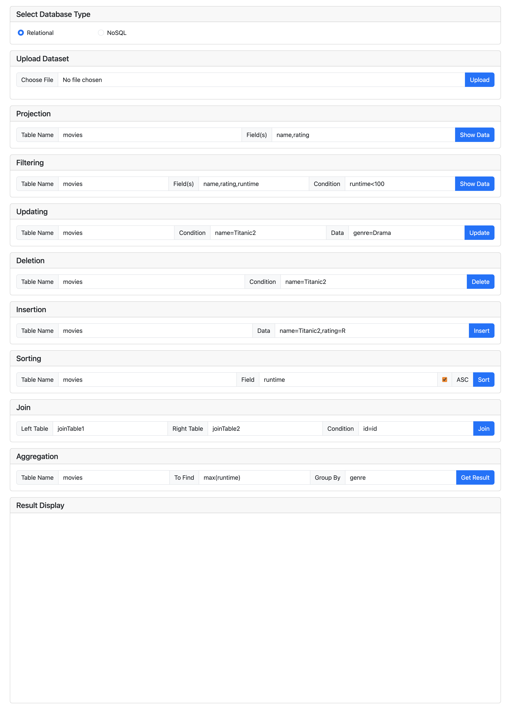
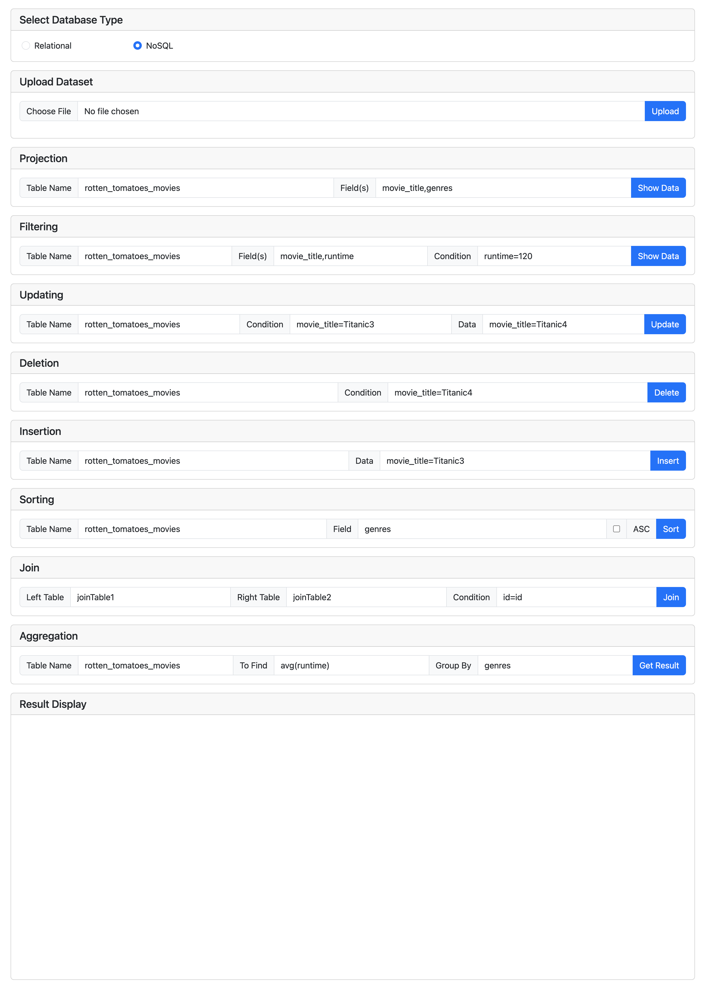

[TOC]

# 551 Final Project

## Project Structure

```bash
.
├── Engine                  # The database engines
│   ├── base.py             # The abstract base engine
│   ├── nosql.py            # The NoSQL engine: implements all NoSQL operations
│   └── relational.py       # The relational engine: all relational operations
├── Results                 # The results generated by backend, send to frontend
│   └── result.txt
├── Storage                 # Stores all table data
│   ├── NoSQL               # Storage for NoSQL, each subdir is a table
│   │   ├── table_1
│   │   │   ├── chunk_1     # chunks for table_1 in NoSQL DB
│   │   │   ├── chunk_2
│   │   │   ...
│   │   ├── table_2         # Another table in NoSQL DB
│   │   │
│   │   ...
│   └── Relational          # Storage for Relational, each subdir is a table
│   │   ├── table_1
│   │   │   ├── chunk_1     # chunks for table_1 in relational DB
│   │   │   ├── chunk_2
│   │   │   ├── schema.txt  # Relational tables have schemas
│   │   │   ...
│   │   ├── table_2         # Another table in relational DB
│   │   │
│   │   ...
├── Temp                    # For temporary data during processing
├── ToBeLoaded              # Put datasets (.csv) to be loaded in this directory
│   └── movies.csv          # A dataset that can be loaded into Storage
├── config.py               # Configs of this system
├── main.py                 # Entry of the CLI
├── run.py                  # Starts the web server
├── static                  # Static data of the web server
│   ├── index.html
│   └── script.js
├── utils                   # Utility functions/Class during processing
│   ├── DocElement.py
│   ├── RowElement.py
│   ├── util.py
│
...
```

## CLI - Relational

### Start

We use the `movies` dataset for demo.

To start the CLI run `python3 main.py`.

```bash
➜ python3 main.py
[relational] or [nosql]>relational # choose relational or nosql
Relational Database selected
your query> # type query here
```

Now we can start type our queries.

\* Note that all our queries end with a semicolon `;`

First we put the dataset `movies.csv` in the `/ToBeLoaded` directory (already done).

Then, we need to load our database into memory using `load data from <dataset_name>;`

```
your query>load data from movies.csv;
movies.csv
loading...
```

Then, the data are loaded into `/Storage/Relational/movies/` and they are stored in different chunks. The number of rows are specified in `/config.py`.

We can now test our other queries.

### Show Tables

Use the query `show tables;` to show all tables in our relational database.

```
your query>show tables;
====================
tables
====================
student
movies
```

### Create Table

Use the query `create table <table_name>(field_1,field_2,field_3);` to create table

\* no space between fields

This will create a folder in `/Storage/Relational/<table_name>` and a `schema.txt` under that folder.

```
your query>create table school(name,address,rank);
table created
your query>show tables;
====================
tables
====================
student
movies
school
```

### Drop Table

Use the query `drop table <table_name>` to drop table;

```
your query>drop table school;
table dropped
your query>show tables;
====================
tables
====================
student
movies
school
```

### Insertion

Use the query `insert into <table_name> with data <field>=<val>,<field>=<val>...;` to insert data.

```
your query>insert into movies with data name=Titanic,genre=Romantic;
insertion succeeded
```

We can check the last chunk in `/Storage/Relational/movies/` to find the data we just inserted.

### Update

Use the query `update in <table_name> <condition> and set <values>;` to update the values.

The following query set the movie named `Titanic` to `Titanic2` and its runtime to `120`.

```
your query>update in movies where name=Titanic and set name=Titanic2,runtime=120;
update succeeded
```

### Deletion

Use the query `delete from <table_name> where <condition>;` to perform deletion.

```
your query>delete from movies where name=Titanic2;
deletion succeeded
```

### Projection

Use the query `show field <fields> from <table_name>;` to perform projection.

Example to show all fields:

```
your query>show field * from movies;
....
selection succeeded
```

Example to show one field:

```
your query>show field name from movies;
====================
name
====================
The Van
Alaska
....
selection succeeded
```

Example to show multiple fields:

```
your query>show field name,rating from movies;
========================================
name                rating
========================================
The Van             R
Alaska              PG
Moll Flanders       PG-13
....
selection succeeded
```

### Filtering

Use the query `show <projection_fields> from <table_name> where <condition>;`

\* Note that we only support condition on one field.

Example:

```
your query>show data name,rating from movies where rating=R;
========================================
name                rating
========================================
The Van             R
Bal na vodi         R
Certain Fury        R
Bliss               R
....
filtering succeeded
```

### Aggregation with grouping

We support `max`, `min`, `avg`, `sum` and `count` as our aggregation functions;

Use the query `find <agg> in movies group by <field>;` to perform aggregation with groupping.

\* Note that this may take some time to process.

Examples:

```
your query>find max(runtime) in movies group by genre;
========================================
genre               max(runtime)
========================================
Action              201.0
Adventure           219.0
Animation           137.0
....
aggregate succeeded
your query>find min(runtime) in movies group by genre;
========================================
genre               min(runtime)
========================================
Action              0.0
Adventure           73.0
Animation           63.0
Biography           79.0
....
aggregate succeeded
your query>find count(name) in movies group by year;
========================================
year                count(name)
========================================
1980.0              92
1981.0              113
1982.0              126
1983.0              144
....
aggregate succeeded
your query>find avg(runtime) in movies group by year;
========================================
year                avg(runtime)
========================================
1980.0              107.4
1981.0              105.96
1982.0              105.93
1983.0              102.27
....
aggregate succeeded
your query>find sum(votes) in movies group by genre;
========================================
genre               sum(votes)
========================================
Action              239541188.0
Adventure           43358242.0
Animation           43153458.0
Biography           40057318.0
....
aggregate succeeded
```

### Aggregate without grouping

This performs the aggregation function on the whole table.

Use the query `find <agg> in <table_name>;` to perform aggregation without grouping.

```
your query>find max(year) in movies;
====================
max(year)
====================
2020.0
aggregate succeeded
your query>find count(name) in movies;
====================
count(name)
====================
7667
aggregate succeeded
```

### Grouping without aggregation

Essentially to removing duplicates because we only support grouping on one field.

Use the query `group <table_name> by <field>;` to perform grouping without aggregation.

```
your query>group movies by genre;
====================
genre
====================
Action
Adventure
Animation
Biography
....
group succeeded
```

### Join

Load the dataset `joinTable1.csv` to DB

```
your query>load data from joinTable1.csv;
```

Load the dataset `joinTable2.csv` to DB

```
your query>load data from joinTable2.csv;
```

Perform inner join using `join <left_table> and <right_table> on <condition>`

```
your query>join joinTable1 and joinTable2 on id=id;
```

```
your query>join joinTable1 and joinTable2 on id>id;
```

### Sorting

We support sorting by ascending or descending order.

Use the query `sort data in <table_name> by <field> <asc|desc>;` to perform sorting.

```
your query>sort data in movies by genre asc;
....
sorting succeeded
```

```
your query>sort data in movies by year desc;
....
sorting succeeded
```

## CLI - NoSQL

<u>The query structures for nosql are exactly the same for NoSQL Database.</u>

We will use a different dataset for demo the NoSQL engine.

### Start

We use the `rotten_tomatoes_movies` dataset for demo.

To start the CLI run `python3 main.py`.

```bash
➜ python3 main.py
[relational] or [nosql]>nosql # choose relational or nosql
NoSQL Database selected
your query> # type query here
```

Now we can start type our queries.

\* Note that all our queries end with a semicolon `;`

First we put the dataset `rotten_tomatoes_movies.csv` in the `/ToBeLoaded` directory (already done).

Then, we need to load our database into memory using `load data from <dataset_name>;`

\* This may take some time, please be patient.

```
your query>load data from rotten_tomatoes_movies.csv;
rotten_tomatoes_movies.csv
loading data...
loading succeeded
```

Then, the data are loaded into `/Storage/NoSQL/rotten_tomatoes_movies/` and they are stored in different chunks. The number of rows are specified in `/config.py`.

We can now test our other queries.

### Show Tables

```
your query>show tables;
{
    "table": "rotten_tomatoes_movies"
}
{
    "table": "test"
}
```

### Create Table

Note that although the query is the same as relational database, NoSQL doesn't support schema, so we can put `school();` without supplying any fields;

```
your query>create table school(name,address,rank);
Warning: NoSQL does not support schema!
table created
your query>show tables;
{
    "table": "rotten_tomatoes_movies"
}
{
    "table": "test"
}
{
    "table": "school"
}
```

### Drop Table

```
your query>drop table school;
table dropped
{
    "table": "rotten_tomatoes_movies"
}
{
    "table": "test"
}
```

### Insertion

```
your query>insert into rotten_tomatoes_movies with data movie_title=Titanic,runtime=120;
insertion succeeded
your query>
```

This will create new data doc in the last chunk under the `Storage/NoSQL/rotten_tomatoes_movies` directory.

### Update

```
your query>update in rotten_tomatoes_movies where movie_title=Titanic and set movie_title=Titanic2,directors=James;
update succeeded
your query>
```

### Deletion

```
your query>delete from rotten_tomatoes_movies where movie_title=Titanic2;
deletion succeeded
your query>
```

### Projection

All fields

```
your query>show field * from rotten_tomatoes_movies;
....
projection succeeded
```

One field

```
your query>show field movie_title from rotten_tomatoes_movies;
....
projection succeeded
```

Multiple fields

```
your query>show field movie_title,directors from rotten_tomatoes_movies;
....
projection succeeded
```

### Filtering

```
your query>show data movie_title,runtime from rotten_tomatoes_movies where runtime=120;
....
filtering succeeded
```

### Aggregation with grouping

This may take some time for external sorting

`max()`:

```
your query>find max(runtime) in rotten_tomatoes_movies group by genres;
....
aggregation succeeded
```

`min()`:

```
your query>find min(runtime) in rotten_tomatoes_movies group by genres;
....
aggregation succeeded
```

`count()`

```
your query>find count(movie_title) in rotten_tomatoes_movies group by genres;
....
aggregation succeeded
```

`avg()`

```
your query>find avg(runtime) in rotten_tomatoes_movies group by genres;
....
aggregation succeeded
```

`sum()`

```
your query>find sum(runtime) in rotten_tomatoes_movies group by movie_title;
....
aggregation succeeded
```

### Aggregation without grouping

```
your query>find max(runtime) in rotten_tomatoes_movies;
....
aggregation succeeded
```

```
your query>find avg(runtime) in rotten_tomatoes_movies;
....
aggregation succeeded
```

```
your query>find count(runtime) in rotten_tomatoes_movies;
....
aggregation succeeded
```

### Grouping without aggregation

```
your query>group rotten_tomatoes_movies by genres;
....
grouping succeeded
```

### Join

Load the dataset `joinTable1.csv` to DB

```
your query>load data from joinTable1.csv;
```

Load the dataset `joinTable2.csv` to DB

```
your query>load data from joinTable2.csv;
```

Perform inner join using `join <left_table> and <right_table> on <condition>`

```
your query>join joinTable1 and joinTable2 on id=id;
```

```
your query>join joinTable1 and joinTable2 on id>id;
```

### Sorting

```
your query>sort data in rotten_tomatoes_movies by genres asc;
....
order succeeded
```

```
your query>sort data in rotten_tomatoes_movies by genres desc;
....
order succeeded
```

## Web - Relational

To start the web application, run `python3 run.py` and navigate to the index file.

Following screenshot is an example to use relational engine to query data. The results will be displayed in the <u>Result Display</u> part after you click the blue buttons.

\* Note that if you want to upload a new `.csv` dataset using the web application, you can use the Upload Dataset section. It will send the `.csv` to the backend and the backend will store the dataset in `/ToBeLoaded` directory. Then it will be loaded to the database storage. Since we've already included our dataset for demostration in the `/ToBeLoaded` directory, we skipped the step to show the upload function in our web application.



## Web - NoSQL

Following screenshot is an example to use NoSQL engine to query data. The results will be displayed in the <u>Result Display</u> part after you click the blue buttons.




