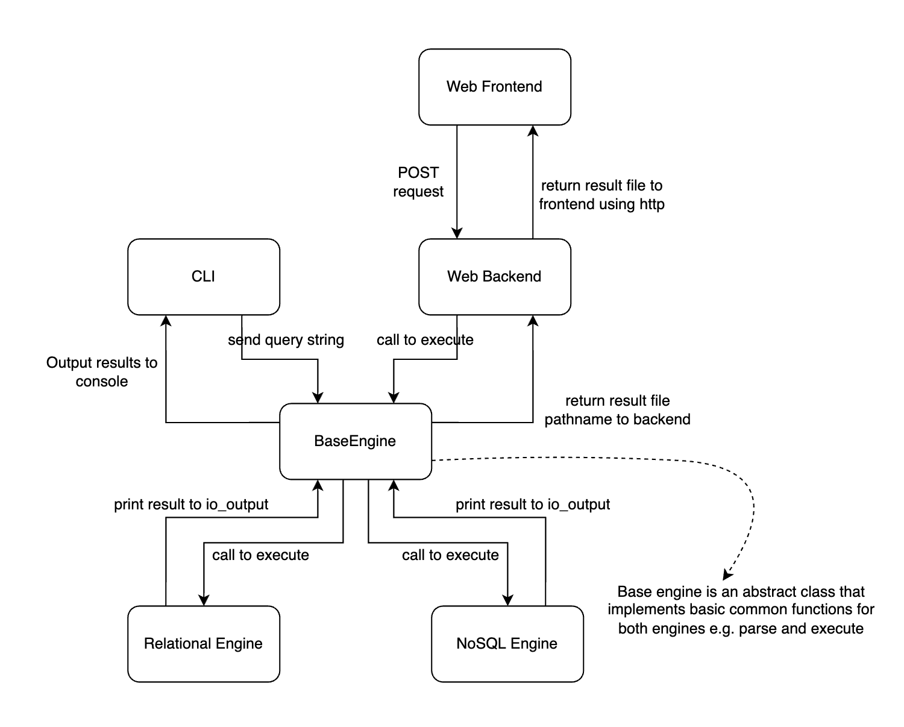
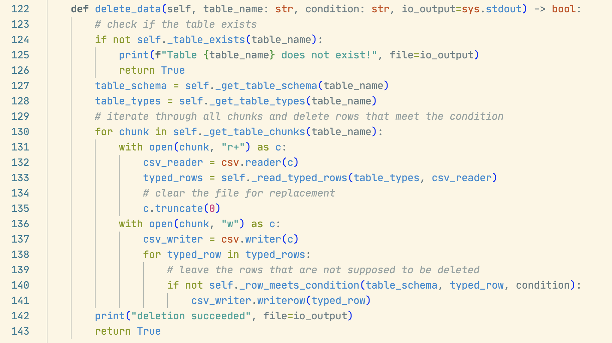
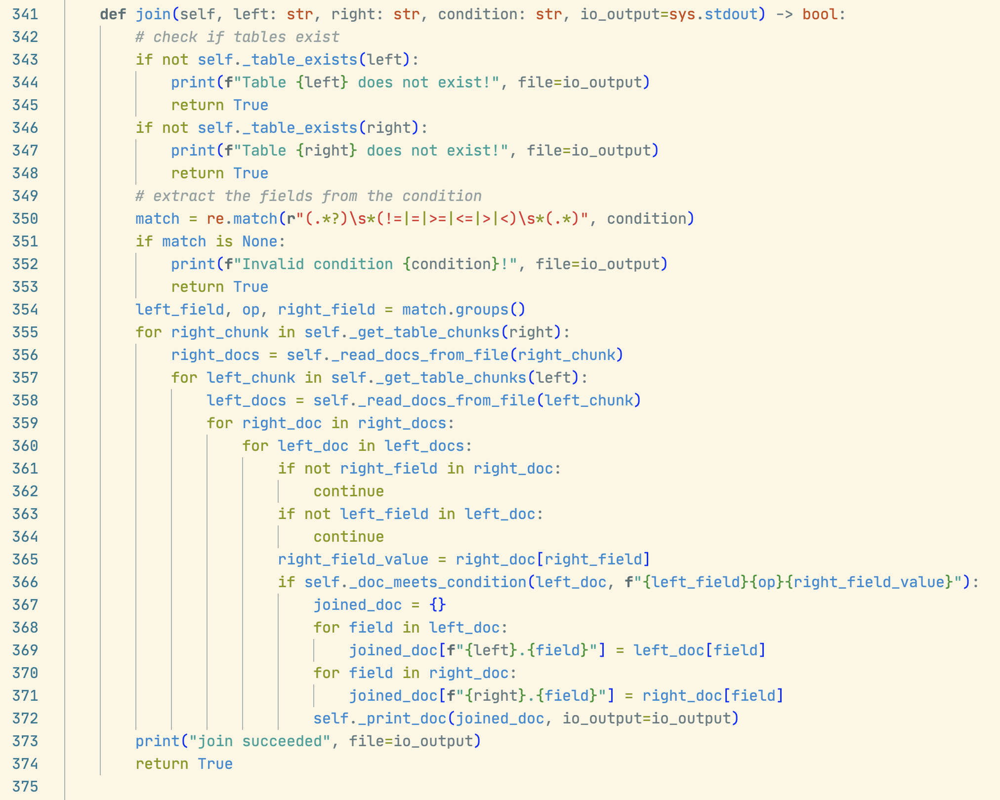

[TOC]

<div style="page-break-before:always"></div>

# Introduction

We are a three person team (group 34) and we built a database system called AwesomeDB. We designed different database engine for our database system that provides support for relational and nosql functionalities. We provided two real-life large datasets form kaggle, `movies.csv` and `rotten_tomatoes_movies.csv` for testing our databases. Since the two data set doesn't have tables to be joined, we also supplied the `joinTable1.csv` and `joinTable2.csv` for testing join operations. All storage and operations are processed in chunks so that we only need to load a limited amount of data into main memory at a time. This project also provides a CLI and Web app for users to interact with our database system. We also designed a query language of our own to query the database in the CLI.

# Planned Implementation

Our proposed database system is designed to empower users to interact with databases using English-like syntax for a range of operations, including insertion, deletion, updating, grouping, ordering, joining, projection, and aggregation. We will parse and execute these syntaxes. The system will feature a user interface that allows users to choose between a relational engine or a NoSQL engine for executing operations.

For relational databases, our plan is to split files into chunks in CSV format to minimize memory usage. For NoSQL databases, we intend to split files into chunks in JSON format for the same purpose. Following the chunking process, we will implement each function by handling individual chunks.

In addition, we aim to develop a web application that showcases all functionalities and displays results on the frontend. The application will communicate with the web backend, sending the pathname of the result file. For the backend, our plan is to build it using Flask, which will then relay this file to the frontend via HTTP. This comprehensive design aims to provide a seamless and user-friendly interface for database operations, accessible through both the command-line interface (CLI) and web applications.

# Architecture Design

## Flow Diagram



## Modules Description

```bash
.
├── Engine                  # The database engines
│   ├── base.py             # The abstract base engine
│   ├── nosql.py            # The NoSQL engine: implements all NoSQL operations
│   └── relational.py       # The relational engine: all relational operations
├── Results                 # The results generated by backend, send to frontend
│   └── result.txt
├── Storage                 # Stores all table data
│   ├── NoSQL               # Storage for NoSQL, each subdir is a table
│   │   ├── table_1
│   │   │   ├── chunk_1     # chunks for table_1 in NoSQL DB
│   │   │   ├── chunk_2
│   │   │   ...
│   │   ├── table_2         # Another table in NoSQL DB
│   │   │
│   │   ...
│   └── Relational          # Storage for Relational, each subdir is a table
│   │   ├── table_1
│   │   │   ├── chunk_1     # chunks for table_1 in relational DB
│   │   │   ├── chunk_2
│   │   │   ├── schema.txt  # Relational tables have schemas
│   │   │   ...
│   │   ├── table_2         # Another table in relational DB
│   │   │
│   │   ...
├── Temp                    # For temporary data during processing
├── ToBeLoaded              # Put datasets (.csv) to be loaded in this directory
│   └── movies.csv          # A dataset that can be loaded into Storage
├── config.py               # Configs of this system
├── main.py                 # Entry of the CLI
├── run.py                  # Starts the web server
├── static                  # Static data of the web server
│   ├── index.html
│   └── script.js
├── utils                   # Utility functions/Class during processing
│   ├── DocElement.py
│   ├── RowElement.py
│   ├── util.py
│
...
```

# Implementation

## Storage and Chunking

We store all data loaded in our database under the the `/Storage` directory.

<div style="page-break-before:always"></div>

```bash
.
├── Storage                 # Stores all table data
│   ├── NoSQL               # Storage for NoSQL, each subdir is a table
│   │   ├── table_1
│   │   │   ├── chunk_1     # chunks for table_1 in NoSQL DB
│   │   │   ├── chunk_2
│   │   │   ...
│   │   ├── table_2         # Another table in NoSQL DB
│   │   │
│   │   ...
│   └── Relational          # Storage for Relational, each subdir is a table
│   │   ├── table_1
│   │   │   ├── chunk_1     # chunks for table_1 in relational DB
│   │   │   ├── chunk_2
│   │   │   ├── schema.txt  # Relational tables have schemas
│   │   │   ...
│   │   ├── table_2         # Another table in relational DB
│   │   │
│   │   ...
```


Once a dataset is loaded into our database, it is stored in chunks. To load a database, it is first stored/uploaded by the user to the `/ToBeLoaded` directory. Then, the database engine calls the `load_data()` which calls the `_insert_row()` or `_insert_doc()` function. This function detects if the chunk with largest chunk number is full. If it is not full, we insert the row/doc into that chunk, otherwise, we have to create a new chunk and store the new row/doc in that chunk. Once a user inserts a new data the engine also calls the `_insert_row()` or `_insert_doc()` function.

For relational data, we store the chunks as `.csv` files. We also have a `schema.txt` for each table to record the schema and data types of each row.

For NoSQL storage, all data are stored as JSON docs. Therefore, we don't store the chunks as `.csv` but as a text file with no file extension. Each line in the chunks is a string that can be deserialized into JSON docs.

The `CHUNK_SIZE` is specified in the `/config.py` file.

Following is a screenshots of the `_insert_row()` function.

<div style="page-break-before:always"></div>


## CLI

Use `python3 main.py` to start a CLI of our program. Follow the prompt to type queries.


Our queries are parsed and validated using regular expression. The keywords in the queries are extracted in the `parse_and_execute()` function in the `BaseEngine` class and passed to execution functions. Following is a screenshot of the regular expression of our queries.


## Web App

We use Flask for backend and serves the `/static/index.html` as static files to our user. The `index.html` are styled using Bootstrap. The `/static/script.js` is linked with the page and it uses `async/await` with fetch API to make HTTP POST request to the backend and receives the result file and display the content in the result display section.

To start the backend server, run `python3 run.py`. Use a web browser to navigate to the index page hosted our local server.

Following is a screenshot of the web page and the query result of showing the fields `name,rating` from the movies dataset.

<div style="page-break-before:always"></div>


The backend receives the HTTP request and choose the corresponding database engine to execute the query. Then it sends back a result file to the front end. Following is a description of the web backend function to filter data.

<div style="page-break-before:always"></div>


## Insertion

The insertion method calls the `_insert_row()` or `_insert_doc()` functions as we discussed about in the <u>Storage and Chunking</u> section. Following is a screenshot of the relational insertion.

For example, in our NoSQL database implementation, the `insert_data` method within the NoSQL class, extending the BaseEngine class, handles data insertion. First, it checks if the specified table exists, halting the process if the table is absent. For existing tables, the method takes input data, provided as a list of `field_name=field_value` pairs, splits these strings, and converts values to the correct data type using the _get_typed_value method. This ensures the data is in a JSON-compatible format. The converted data is then compiled into a document and inserted into the table with the` _insert_doc` method. A confirmation message is displayed upon successful insertion, confirming the data has been added.

<div style="page-break-before:always"></div>


## Deletion/Updating/Projection/Filtering

All of the four methods take a similar approach to do the operation in chunks. 

1. The system loads one chunk into memory
2. Find the rows/docs that satisfies the condition, 
3. Then process each row/doc, and print the result to the `io_output`. 

Then the system then proceeds to the next chunk. Below is an example of how deletion works in relational DB.

<div style="page-break-before:always"></div>



### Deletion

Relational: We iterate through all chunks and delete the row that meets the condition. retrieving the schema and types information for the table, For each chunk, it opens the file in read and write mode ("r+"). It reads the typed rows from the chunk using the _read_typed_rows method, which likely involves reading and parsing the rows with their associated data types. It truncates the file to prepare for replacement and opens the same file in write mode ("w") and writes back the rows that do not meet the deletion condition.

NoSQL: For each chunk obtained using _get_table_chunks, the method reads the documents from the chunk using the _read_docs_from_file method. It then clears the content of the file using _clear_file. Using the filter function, it selects the documents that do not meet the deletion condition. Finally, it writes the filtered documents back to the file using the _write_docs_to_file method.

### Update

Relational: It retrieves the schema and types information firstly, Iterates Through Chunks and Update Rows: For each chunk obtained using _get_table_chunks, the method opens the file in read and write mode ("r+"). It reads the typed rows from the chunk using the _read_typed_rows method and clears the file for replacement. Then opens the same file in write mode ("w") and iterates through the typed rows. For each row, if it meets the specified condition, it updates the row based on the provided data: Converts the row to a dictionary. Updates the values in the dictionary based on the new data. Converts the updated dictionary back to a row and writes the new row to the file. If the row does not meet the condition, it writes the existing row to the file without modification

NoSQL: reads the documents from the chunk and obtains each chunk. It then clears the content of the file For each document in the chunk, if it meets the specified condition: It iterates through the provided data, updating the corresponding fields in the document. It writes the updated document back to the file

### Projection

In our relational database, the projection method is designed to display specific fields from a table. After confirming the existence of the table, we get the schema of the table, and then create a schema for the projected data, either including all fields or only specified fields. First we check if the requested fields exist in the table’s schema, printing an error and halting if any field is not found. Once verified, it prepares a format string for displaying data and prints the header. Then iterates through the table's data chunks, converts each row into a dictionary, and prints only the requested fields using the prepared format. The process concludes with a success message, indicating the successful completion of the data projection operation. 

<div style="page-break-before:always"></div>


In our NoSQL database system, the projection function begins by verifying the existence of the table.t then reads data in chunks from the table using _get_table_chunks and processes each document with _read_docs_from_file. For every document, it either displays the entire document if the user requests all fields or only includes specific fields as per the user's request. The method checks each requested field with the field in the document, including them in the result if they match. Then we print the projected result.

<div style="page-break-before:always"></div>


### Filtering

Relational: It retrieves the schema and types information first. Then, creating projection schema: If the specified fields include all fields ('*'), the projection schema is set to the entire table schema. If specific fields are provided, it checks if each field exists in the table schema. Then, It creates a schema for the projection table based on the specified fields. Next, Iterating through chunks and printing filtered Rows: For each chunk obtained using _get_table_chunks, the method opens the file in read mode. It reads the typed rows from the chunk. For each typed row, if it meets the specified condition, It converts the row to a dictionary

<div style="page-break-before:always"></div>


NoSQL: For each chunk obtained using _get_table_chunks, the method reads the documents from the chunk. For each document in the chunk, if it meets the specified condition: If the specified fields include all fields ('*'), the entire document is projected. Otherwise, only the specified fields are included in the projected document.

<div style="page-break-before:always"></div>


## Sorting

The key part of sorting is to implement external merge sort. It is split into two phases.

Sorting phase:

1. The system loads one chunk into memory
2. Sort the chunk, copy the result into the temp folder
3. Close the reader
4. Proceed to the next chunk
5. ....

Below is the implementation of the sorting phase


After the sorting phase, the temp folders are filled with sorted chunks. We can now start the mergine phase using $k-$way mergine where $k$ is the `CHUNK_SIZE`

1. For `CHUNK_SIZE` number of runs, group them into 1 merge group
2. Load one row/doc from each run in the current merge group into a priority queue.
3. Poll the largest/smallest elements write to another run for the next pass, and load next row/doc from the same run if there are any row/doc remaining.
4. Proceed to the next merge group.
5. If we are done with the current pass, we proceed to the next pass.

After all the runs are merged into one run in the temp dir, we return the path of the result.

The following is a screenshot of the merging phase.

<div style="page-break-before:always"></div>


Then we can called the `_external_sort()` method to get a path in the temp directory that stores the sorted data.

## Join

For both relational and NoSQL database, we implemented an inner join. We use nested loop join for the relational database and block nested loop join for the NoSQL database. The difference is the result of the difference of the helper method we designed to retreive data from chunks.

Following is a screenshot of the NoSQL join operation.

<div style="page-break-before:always"></div>



Note that for both databases we are using the right table as the outter table because we are doing a convertion of condition in the inner loop to satisfy the design of the `_doc_meets_condition()` method. If we use the left table as the outter table, we have to reverse the operator `op`. Using right table as the outter table should be an simpler approach to tackle the same issue. The performance should be the same no matter which table serves as the outter table.

## Group and Aggregation

For group and aggregation, we utilized the external sort method we implemented as described in the <u>sorting</u> section. We support `max, min, sum, avg, count` as aggregation functions. To perform an aggregation with groupping:

1. Do external sort based on the `group_field` on this table and get the temporary sorted file.

2. Read the result row by row

   \* Python `next(reader)` method optimized the function so that it wouldn't load the entire file into memory when we iterate through each row in a file.

3. If the value of the `group_field` changes, we know that we have iterated all the previous group. So we can now output the result of the previous group.

4. We proceed to the next row until end of file

Below is a screenshot of the aggregation and groupping in the NoSQL database.

<div style="page-break-before:always"></div>


We also supports and optimized the cases to 

- aggregate a whole table without groupping (the `aggregate_table()` method) and 

  $\rightarrow$ scan the whole table as in filtering without external sorting

- groupping without aggregation (the `group()` method)

  $\rightarrow$ basically remove duplicated values in the group field


# Learning Outcomes

In our database system project, we encountered various challenges. Managing large CSV files effectively, particularly breaking them down for efficient memory usage, was a key challenge. Creating an English-like query language was another challenge, as it needed to be both user-friendly and capable of handling complex database operations.

Our learning heavily focused on key database functionalities like external sorting. This was crucial for operations such as grouping and aggregation, where sorting segmented files before processing was necessary.

Furthermore, the development of a web application to display our functions introduced added complexity. It required a seamless integration of an accessible frontend interface with the more complex backend database system.

Understanding and following the project guidelines also posed a challenge. The project had various specific requirements, and we often found ourselves revisiting the guidelines to make sure our implementation aligned with the expected standards. This process was crucial in ensuring that our project met all the necessary criteria.

In our AwesomeDB project, we mastered optimizing memory usage for large CSV files and developed a custom query language, enhancing our skills in database management. We deepened our understanding of relational and NoSQL data types, along with functionalities like join, group by, filtering, and aggregation. Specifically, we gained insights into nested loop joins and external sorting. Additionally, we learned to build a web application to showcase our database system, improving our full-stack development capabilities. This project significantly advanced our proficiency in handling diverse database operations and user interface design
